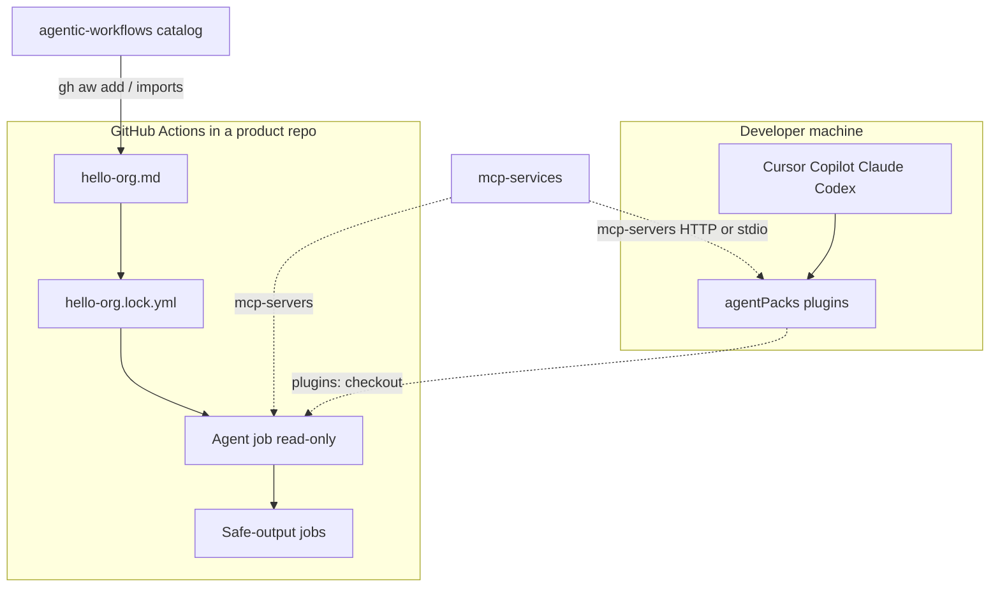

# How GitHub Agentic Workflows work

This catalog is not an application. It is a **package of Markdown workflows** that other GitHub repositories compile into GitHub Actions.

## Two different “agent” layers

Keep these separate. They share skills and MCP, but they run in different places.

| Layer | Repo | Runs where | Who starts it |
| --- | --- | --- | --- |
| IDE / CLI Agent Plugins | [`agentPacks`](https://github.com/svennijhuis/agentPacks) | Cursor, Copilot CLI, Claude Code, Codex on a developer machine | A person (`/squad`, `/pack-check`, …) |
| GitHub Agentic Workflows | **this repo** | GitHub Actions in a consuming repository | A trigger (`schedule`, `issues`, `pull_request`, `workflow_dispatch`) |

Do not copy plugin skills into this catalog. Wire them in with `plugins:` / `skills:` (see [AGENTPACKS.md](AGENTPACKS.md)).

MCP servers that both layers can call live in [`mcp-services`](https://github.com/svennijhuis/mcp-services).



## What a workflow file is

Each installable file under `workflows/` is Markdown with YAML frontmatter:

1. **Frontmatter** (`on`, `engine`, `tools`, `imports`, `safe-outputs`, `permissions`, …) is compiled.
2. **Body** is the agent prompt. Body-only edits apply on the next run without recompile.

Files under `workflows/shared/` **omit `on:`**. They are fragments: tools, network, plugins, MCP, prompt policy. The compiler merges them into whatever workflow imports them. They never become standalone Actions.

Relative `imports: [shared/foo.md]` resolve from the workflow file’s directory, which is why fragments live at `workflows/shared/` (same pattern as [githubnext/agentics](https://github.com/githubnext/agentics)).

## Compile and lock files

```text
workflows/hello-org.md
        │  gh aw add   (in the consuming repo)
        ▼
.github/workflows/hello-org.md      # source, with source: recorded
.github/workflows/hello-org.lock.yml # generated Actions YAML
```

- `gh aw compile` regenerates `.lock.yml` after frontmatter changes.
- Commit **both** files. Actions runs the lock file, not the Markdown.
- `.lock.yml` is marked generated in [`.gitattributes`](../.gitattributes).

This catalog normally does **not** compile templates. Compilation happens in the repo that installed them. `.github/workflows/` in *this* repo is reserved for a later [control plane](CONTROL-PLANE.md).

## Runtime security model

The agent job is intended to stay **read-only**. Writes go through `safe-outputs:` (create issue, comment, pull request, dispatch another workflow). A separate job with explicit permissions executes those requests.

Cross-repo writes need:

- `target-repo` and/or `allowed-repos`
- a GitHub App or PAT (App preferred)
- `max:` limits on each output type

See [Safe Outputs](https://github.github.com/gh-aw/reference/safe-outputs/) and [Authentication](https://github.github.com/gh-aw/reference/authentication/).

## Package install (`aw.yml`)

[`aw.yml`](../aw.yml) at the repo root tells `gh aw add svennijhuis/agentic-workflows` which Markdown files are the install bundle. Nested packages (`owner/repo/path/to/package`) are possible later; start with one root package.

Official spec: [Package Manifest](https://github.github.com/gh-aw/reference/aw-yml-package-manifest/).

## Org-wide defaults (not files in product repos)

Model, timeout, and AIC budgets can be set as GitHub Actions **organization variables** (`GH_AW_DEFAULT_*`) so every workflow inherits them unless frontmatter overrides. Example file: [`governance/defaults.example.yml`](../governance/defaults.example.yml). Apply with `gh aw env update` — see [Governance](https://github.github.com/gh-aw/guides/governance/).

## Official guides this structure follows

- [Using at Scale](https://github.github.com/gh-aw/guides/using-at-scale/)
- [Sharing Workflows](https://github.github.com/gh-aw/practices/sharing-workflows/)
- [Working with Workflows](https://github.github.com/gh-aw/guides/working-with-workflows/)
- [Imports](https://github.github.com/gh-aw/reference/imports/)
- [Frontmatter](https://github.github.com/gh-aw/reference/frontmatter/)
